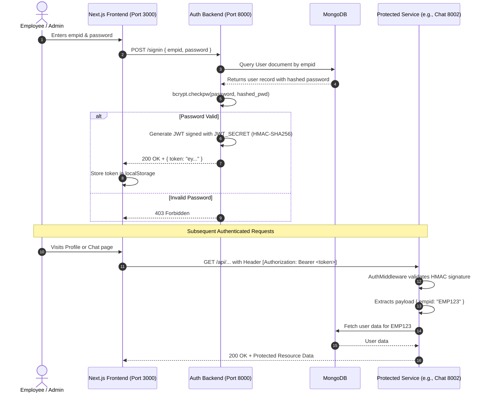

# 🧠 AI Wellness Chatbot & Employee Analytics Platform
## System Architecture, Networking, and OS Concepts Explained

> **For Engineers, Teammates, and Reviewers**  
> *Written from first principles using Computer Networks (CN) and Operating Systems (OS) fundamentals.*

---

## 📌 1. High-Level Overview

This project is a **distributed microservice platform** designed for enterprise employee wellness monitoring, conversational AI support, and behavioral analytics.

Instead of a single monolithic backend, the architecture splits responsibility across **specialized microservices** communicating over both **HTTP/REST** and **high-performance gRPC (RPC over HTTP/2)**, backed by **asynchronous task workers (Celery)**, **in-memory caching (Redis)**, and **document storage (MongoDB)**.

```mermaid
graph TD
    Client["Browser / Client (Next.js UI: Port 3000)"]
    
    subgraph "HTTP/REST Layer (FastAPI)"
        AuthService["gc-auth-backend (Port 8000)<br/>Auth, Users, Meets, Email"]
        ChatService["gc-chat-backend (Port 8002)<br/>LangGraph, Gemini LLM, Memory"]
        ReportService["gc-report-backend (Port 8005)<br/>PDF/Data Reports"]
    end

    subgraph "gRPC & Asynchronous Worker Layer"
        ScheduleService["gc-scheduler-backend (Port 50051)<br/>Periodic Checks, Celery Beat"]
        UpdateService["gc-update-backend (Port 50052)<br/>Event & Metric Aggregator"]
    end

    subgraph "Storage & Caching (Persistence & In-Memory)"
        MongoDB[("MongoDB (Port 27017)<br/>Primary NoSQL Database")]
        RedisMain[("Redis Main (Port 6379)<br/>Auth Cache & Celery Broker")]
        RedisAlt[("Redis Alt (Port 6380)<br/>Scheduler Queue")]
        SQLite[("SQLite (Disk File)<br/>LangGraph Checkpoints")]
    end

    %% Client Connections
    Client -->|HTTP / JSON (Bearer JWT)| AuthService
    Client -->|HTTP / JSON (Bearer JWT)| ChatService
    Client -->|HTTP / JSON (Bearer JWT)| ReportService

    %% Microservice IPC via gRPC
    ChatService -->|gRPC / Protobuf| ScheduleService
    ChatService -->|gRPC / Protobuf| UpdateService

    %% Storage Connections
    AuthService --> MongoDB
    AuthService --> RedisMain
    ChatService --> SQLite
    ScheduleService --> RedisAlt
    ScheduleService --> MongoDB
    UpdateService --> MongoDB
    ReportService --> MongoDB
```

---

## 🌐 2. Computer Networks (CN) Perspective

If you understand the OSI 7-layer model and transport protocols, here is how the data flows across the network:

### A. Layer 7 (Application Layer): HTTP vs. gRPC
1. **Frontend to Backend (HTTP/1.1 & HTTP/2 with JSON)**:
   - The browser communicates with public FastAPI endpoints via standard HTTP methods (`GET`, `POST`, `OPTIONS`).
   - Payloads are serialized as UTF-8 **JSON** strings.
   - Headers carry metadata, notably:
     ```http
     Authorization: Bearer <JSON_WEB_TOKEN>
     Content-Type: application/json
     ```

2. **Backend-to-Backend Inter-Process Communication (gRPC over HTTP/2)**:
   - Internal backends (`gc-chat-backend` $\leftrightarrow$ `gc-scheduler-backend`, `gc-update-backend`) do **not** use JSON. They communicate via **gRPC**.
   - **Protocol Buffers (`.proto`)**: Binary serialization format defined in `.proto` files (e.g., `task.proto`, `user.proto`). It is significantly faster to serialize/deserialize than text-based JSON and produces much smaller payload sizes over the wire.
   - **HTTP/2 Transport**: Supports binary framing, header compression (HPACK), and persistent multiplexed TCP connections (multiple RPC requests over a single TCP socket without head-of-line blocking).

### B. Layer 4 (Transport Layer): TCP Sockets & Ports
Every service binds to an OS socket listening on a specific TCP port:
| Service | Technology | Port | Protocol | Purpose |
| :--- | :--- | :--- | :--- | :--- |
| **`opensoft`** | Next.js (React) | `3000` | HTTP / TCP | Web User Interface |
| **`gc-auth-backend`** | FastAPI / Python | `8000` | HTTP / TCP | Login, Signup, RBAC, Profiles |
| **`gc-chat-backend`** | FastAPI / Python | `8002` | HTTP / TCP | Conversational AI & LangGraph |
| **`gc-report-backend`** | FastAPI / Python | `8005` | HTTP / TCP | Report Generation |
| **`gc-schedule-backend`**| gRPC + Celery | `50051`| gRPC / HTTP/2 | Periodic cron wellness jobs |
| **`gc-update-backend`**  | gRPC + Celery | `50052`| gRPC / HTTP/2 | Employee metric updates |
| **`redis-main`** | Redis | `6379` | RESP / TCP | In-memory cache & message broker |
| **`redis-alt`** | Redis | `6380` | RESP / TCP | Secondary worker queue |
| **`mongodb`** | MongoDB | `27017`| Wire Protocol | Persistent document storage |

### C. Docker Bridge Network (Virtual LAN)
In `docker-compose.yml`, all containers are attached to a bridge network named `backend-network`:
- **Docker Internal DNS**: Containers resolve each other by container name (e.g., `http://gc-auth-backend:8000`, `redis-main:6379`) without hardcoding private IP addresses.
- **NAT / Port Mapping**: Host ports (`3000`, `8000`, etc.) map traffic from outside into container private IP namespaces.

---

## 💻 3. Operating Systems (OS) Perspective

### A. Non-Blocking I/O and the Event Loop (Async/Await)
FastAPI and Node.js do not spawn a dedicated OS thread per incoming HTTP connection (which would waste memory and cause CPU context switching overhead).
- **Under the Hood**: FastAPI runs on `uvicorn` using `asyncio`, backed by OS primitives like **`epoll`** (Linux) or **`IOCP`** (Windows).
- When a service queries MongoDB or awaits an external Google Gemini API call:
  ```python
  response = await client.post(...)
  ```
  The thread yields control back to the event loop. The OS kernel handles the network socket read/write asynchronously, waking up the event loop when data arrives on the file descriptor.

### B. Inter-Process Communication (IPC) & Task Queues (Celery)
Some operations (e.g. running NLP sentiment analysis on thousands of employee logs or scheduling recurring checks) are CPU or I/O heavy:
- If executed synchronously inside an HTTP request, the web server would block, leading to high latency or request timeouts.
- **Solution (Celery Workers)**:
  1. FastAPI / Scheduler pushes a task descriptor into a **Redis list (FIFO queue)**.
  2. Celery worker daemon processes running in the background dequeue jobs.
  3. **Celery Beat**: Functions as an in-process cron daemon that wakes up periodically according to a schedule and dispatches jobs to workers.

### C. Memory Hierarchy & Storage
- **L1 / Cache Layer (RAM)**: **Redis** holds short-lived flags (`sent_emails`, session caches) with TTLs (Time-To-Live expiration). Latency is sub-millisecond.
- **Persistence Layer (Disk)**: **MongoDB** saves durable documents (user collections, metrics, historical mood data) to disk with write-ahead journaling.
- **Embedded Local Storage**: **SQLite** (`checkpointer.sqlite`) is an embedded relational DB on the local filesystem storing conversation graph states for LangGraph.

---

## 🔐 4. Authentication & Security Flow (Step-by-Step)

Authentication bridges the Frontend, Backend, and Database using **Stateless JSON Web Tokens (JWT)** and **Bcrypt Password Hashing**.



### 1. Password Storage: One-Way Hashing (Bcrypt)
Passwords are **never** stored in plain text.
- `bcrypt.hashpw(password, bcrypt.gensalt())`: Computes a cryptographically salted one-way hash with a configurable computational cost factor (work factor).
- Even if the database is leaked, raw passwords cannot be reversed.

### 2. What is a JWT (JSON Web Token)?
A JWT contains 3 base64url-encoded parts separated by dots (`.`):
$$\text{JWT} = \underbrace{\text{Header}}_{\text{Algorithm \& Token type}} \;.\; \underbrace{\text{Payload}}_{\text{Claims: empid, expiration}} \;.\; \underbrace{\text{Signature}}_{\text{HMAC-SHA256}(\text{Header} + \text{Payload}, \text{SECRET})}$$

Because the backend signs the payload with a secret key:
- The client cannot tamper with `empid` or the `exp` timestamp without invalidating the cryptographic signature.
- **Statelessness**: The server doesn't need to query a database session table on every request. It simply verifies the mathematical signature using CPU cycles.

### 3. Middleware Enforcement (`AuthMiddleware`)
FastAPI registers middleware that intercepts requests before they hit route handlers:
1. Reads `Authorization: Bearer <token>` from HTTP headers.
2. Calls `jwt.decode(token, SECRET_KEY, algorithms=["HS256"])`.
3. If expired $\rightarrow$ Returns `401 Unauthorized ("Token expired")`.
4. If valid $\rightarrow$ Injects `request.state.empid = empid` into request context and forwards request down the pipeline.

---

## 🤖 5. The AI Wellness Engine (`gc-chat-backend`)

The chat backend is powered by **LangGraph** and **Google Gemini**:

1. **State Graph**: The chat session is modeled as a state machine (`StateGraph`).
2. **Context Memory**: Conversation history is checkpointed into SQLite so the agent remembers previous turns.
3. **Structured Outputs**: Uses Pydantic models to parse user sentiment, stressors, work-life balance scores, and query parameters.
4. **Vector Embeddings (Semantic Search)**: Hugging Face sentence transformers convert wellness questions into vector embeddings. MongoDB vector search finds the most relevant knowledge base entries.

---

## 📂 6. Repository Directory Structure

```text
gc25-master/
├── docker-compose.yml          # Orchestrates all services, networks, ports, volumes
├── .gitignore                  # Prevents env files, pycache, node_modules from git
│
├── opensoft/                   # [FRONTEND] Next.js 15, React, TailwindCSS, Lucide UI
│   ├── app/                    # App Router (pages: auth, admin dashboard, profile, relax)
│   ├── components/             # UI widgets, AuthChecker, MoodChart, Navbar
│   └── lib/                    # API URLs, helper functions
│
├── gc-auth-backend/            # [AUTH & CORE API] FastAPI
│   ├── app/server/routes/      # Auth (signup/signin), Admin DB, Meets, Users
│   ├── app/server/models/      # MongoDB Document Schemas (Beanie / Motor)
│   ├── app/server/middlewares/ # JWT verification middleware
│   └── credentials.json        # Google OAuth integration (template)
│
├── gc-chat-backend/            # [AI CHATBOT] FastAPI + LangGraph + Gemini
│   ├── app/server/routes/      # Chat engine endpoints & state graph
│   ├── app/client/             # gRPC clients to query scheduler & update backends
│   └── *.csv, *.json           # Employee wellness datasets & benchmarks
│
├── gc-scheduler-backend/       # [SCHEDULER & CRON] gRPC + Celery + Redis
│   ├── proj/tasks.py           # Periodic email & wellness check tasks
│   └── server.py               # gRPC server on port 50051
│
├── gc-update-backend/          # [METRIC AGGREGATOR] gRPC + Celery
│   ├── protos/                 # Protobuf definitions (.proto)
│   └── server.py               # gRPC server on port 50052
│
└── gc-report-backend/          # [REPORTS] FastAPI
    └── app/utils/              # Employee & team report generators
```

---

## 🚀 7. Running the Project Locally

### Prerequisites
- [Docker & Docker Desktop](https://www.docker.com/) installed
- [Git](https://git-scm.com/) installed

### Running via Docker Compose
All services, networking, and Redis instances can be brought up with one command:

```bash
docker compose up --build
```

### Accessing Endpoints:
- **Web Application**: `http://localhost:3000`
- **Auth API Swagger Docs**: `http://localhost:8000/docs`
- **Chat API Swagger Docs**: `http://localhost:8002/docs`
- **Report API Swagger Docs**: `http://localhost:8005/docs`

---

## 📝 Key Takeaways for Technical Discussions
- **Loose Coupling**: Services are independently scalable and maintainable.
- **Hybrid Communication**: HTTP REST for client-facing simplicity; gRPC for internal low-latency binary throughput.
- **Stateless Authentication**: JWT tokens reduce database query pressure for auth checks.
- **Asynchronous Workloads**: Heavy tasks are offloaded to Celery queues rather than blocking synchronous HTTP request/response loops.
